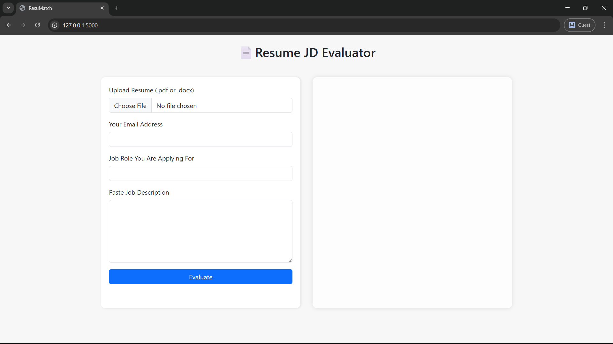
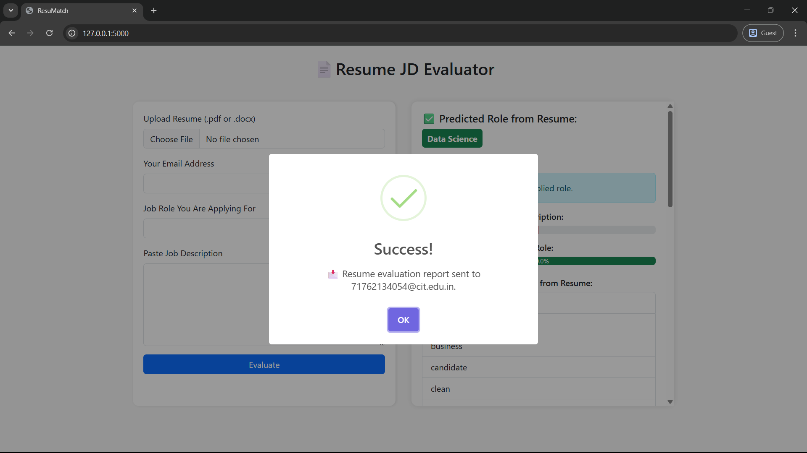
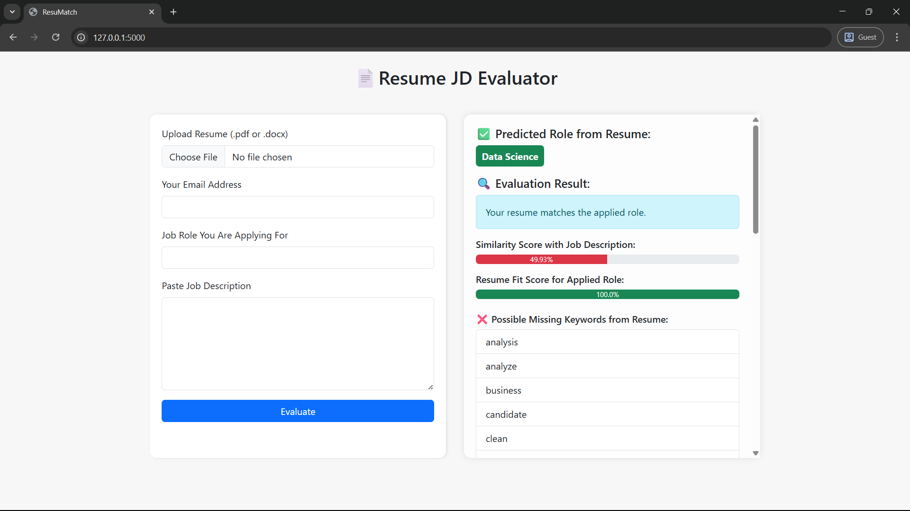

# 📄 ResuMatch - Resume JD Evaluator

An intelligent web application that evaluates a user’s resume against a provided job description (JD), predicts the most probable job role, computes similarity scores, provides enhancement suggestions, and emails a personalized report.

---

## 🚀 Features

- ✅ Upload resume (.pdf / .docx)
- 🎯 Predict job role using trained ML model
- 🤖 Semantic similarity score between resume and JD using Sentence Transformers
- 📊 Resume fit score based on string similarity between applied and predicted role
- 🧠 Suggestions for missing keywords
- 📥 PDF report generation
- 📧 Report auto-emailed to user
- 🗃️ All evaluations logged in SQLite DB
- 🎨 Split-screen UI with SweetAlert notification

---

## 🧠 Model and Architecture

- **ML Role Classifier:** Trained with `TF-IDF + LogisticRegression`
- **Semantic Evaluation:** via `SentenceTransformer ('all-MiniLM-L6-v2')`
- **Resume-JD Score:** Cosine similarity
- **Resume Role Fit Score:** via `difflib.SequenceMatcher`
- **PDF Report:** Generated using `fpdf`

---

## 🛠 Tech Stack

| Layer          | Tech Used                           |
| -------------- | ----------------------------------- |
| **Backend**    | Python, Flask                       |
| **ML/NLP**     | scikit-learn, sentence-transformers |
| **Frontend**   | HTML, CSS, Bootstrap, SweetAlert2   |
| **Parsing**    | PyPDF2, docx2txt                    |
| **PDF Output** | fpdf                                |
| **Database**   | SQLite3                             |
| **Email**      | smtplib, Gmail SMTP                 |

---

## 🗂 Folder Structure

```
project/
│
├── app.py                   # Main Flask app
├── model/
│   └── resume_classifier.pkl
├── templates/
│   └── index.html
├── static/
│   └── styles.css
├── evaluations.db           # SQLite DB
└── README.md                # This file
```

---

## ⚙️ How It Works

1. User uploads resume and enters:
   - Applied role
   - Job description
   - Email
2. Model predicts the role from resume text
3. Semantic similarity between resume and JD is computed
4. Resume fit score is calculated using text similarity
5. Feedback and missing keywords are generated
6. PDF is created and emailed to user
7. Everything is logged into a database

---

## 📧 Gmail SMTP Setup

1. Enable **2-Step Verification** on your Gmail account.
2. Visit: [App Passwords](https://myaccount.google.com/apppasswords)
3. Generate an **App Password** and update in `app.py`:
   ```python
   sender_email = "your_email@gmail.com"
   sender_password = "your_generated_app_password"
   ```

## 🧪 Local Setup

1. Clone the repo
   ```bash
   git clone https://github.com/Tarunika-R/ResuMatch.git
   cd resume-evaluator
   ```
2. Create virtual environment
   ```bash
   python -m venv .venv
   source .venv/bin/activate  # for Linux/Mac
   # OR
   .venv\Scripts\activate     # for Windows
   ```
3. Install dependencies
   ```bash
   pip install -r requirements.txt
   ```
4. Run the server
   ```bash
   python app.py
   ```

---

## 🖼️ UI Screenshots

### 📤 Resume Upload & Input Panel

> 

### 📊 Results and Evaluation Panel

> 

### ✅ Success Notification with Email Sent

> 

---

Then go to: http://localhost:5000/
